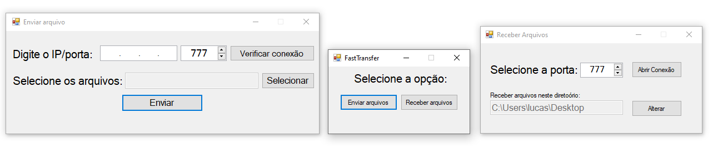

# Projeto FastTransfer
\
[](https://linkedin.com/in/lucas-vinicius-machado/)\
\




> FastTransfer é uma aplicação de transferência de arquivos na rede local para Windows, utilizando a linguagem de programação C# com o .NET Framework 4.8, recebendo atualizações aos fins de semana (único tempo livre que tenho para desenvolver meus projetos pessoais)

Veja o andamento do projeto e as fases de desenvolvimento definidas por mim

````
1. Análise
  1.1. Levantamento de requisitos
  1.2. Análise de requisitos
  1.3. Projeção
2. Desenvolvimento
  >> 2.1. Criação das interfaces gráficas
  2.2. Implementação da biblioteca System.Net.Sockets, System.IO entre outras
  2.3. Adição de novas features
3. Manutenção
  3.1. Testes e correção de bugs
  3.2. Refatoração de código
  3.3. Implantação e finalização
````

### Ajustes e melhorias

O projeto ainda está em desenvolvimento e as próximas atualizações serão voltadas nas seguintes tarefas:

- [x] Criação dos formulários
- [x] Funcionamento básico
- [ ] Criação do cliente
- [ ] Criação do servidor
- [ ] Manipulação de arquivos locais através da aplicação
<br>...

## 💻 Pré-requisitos

Antes de começar, verifique se você atendeu aos seguintes requisitos:
* Você instalou a IDE `<Visual Studio Community>` na sua versão mais recente
* Você instalou a versão 4.8 ou superior do `<.NET Framework>`
* Você tem uma máquina com `<Windows 10 ou 11>`

```
git clone https://github.com/LucasV-Projetos/Projeto-FastTransfer.git
```
> ou clique [aqui](https://github.com/LucasV-Projetos/FastTransfer/archive/refs/heads/main.zip) para fazer download do projeto
## ☕ Executando

Para usar o FastTransfer, siga estas etapas:

```
1. Descompacte o ZIP
2. Entre na pasta FastTransfer
3. Abra o arquivo "FastTransfer.sln" com o Visual Studio
4. "F5" para compilar e executar a aplicação
5. Fique a vontade para editar como quiser
```
